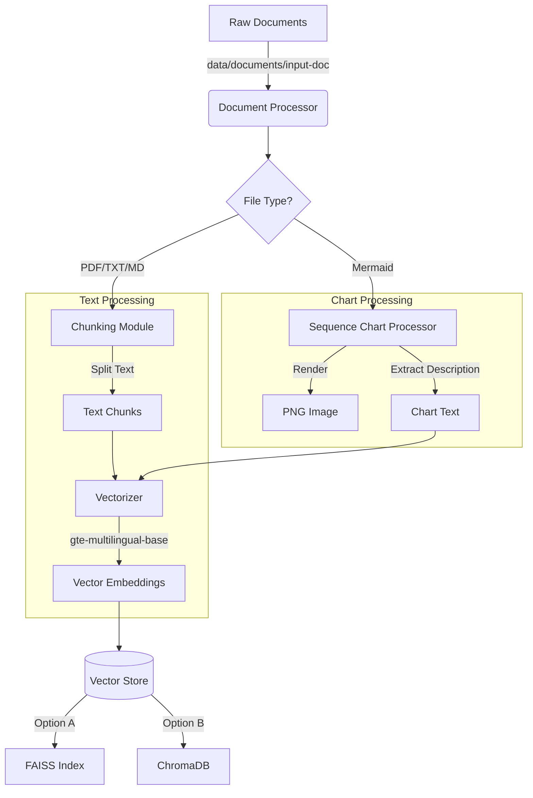
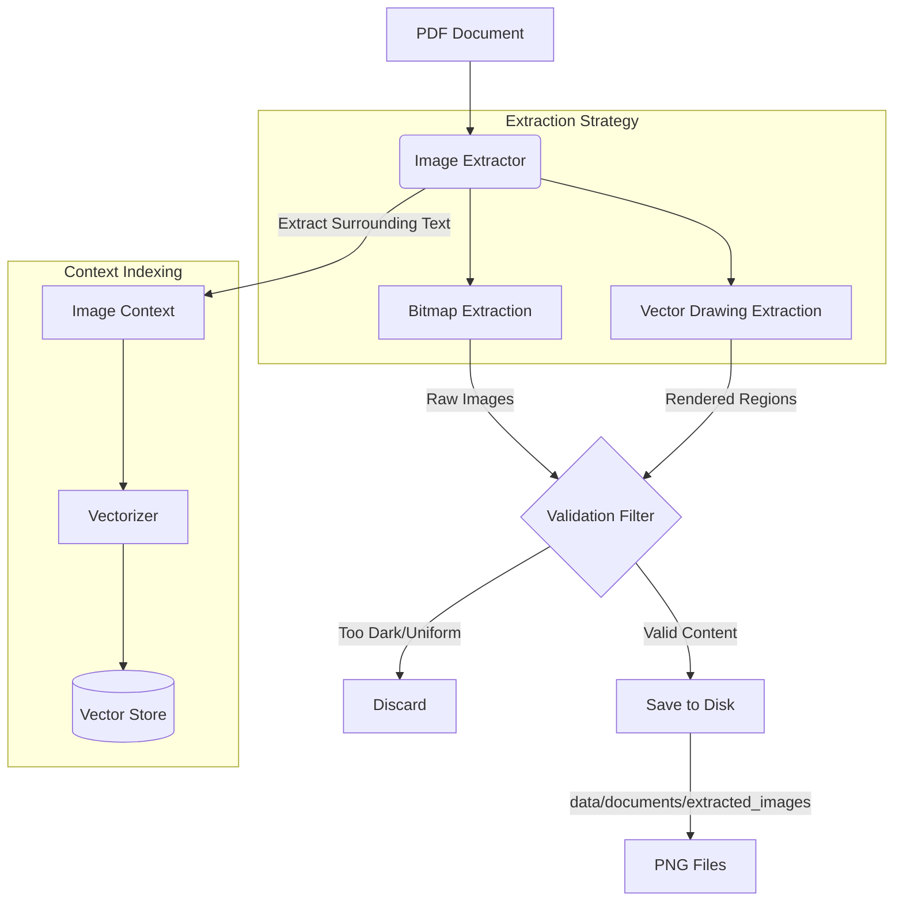

# Project Workflows

This document outlines the core workflows and data pipelines in the Simple RAG System.

## 1. Data Ingestion Pipeline

This pipeline processes raw documents into searchable vector embeddings.



## 2. Image Extraction Pipeline

This pipeline extracts figures and diagrams from PDF documents.



## 3. Search Workflow

How the system retrieves information based on user queries.


## 4. Operational Commands

### Initialization

```bash
python -m src.main init
# Creates necessary directory structure
```

### Processing

```bash
python -m src.main process --input data/documents
# Runs Ingestion Pipeline
```

### Image Extraction

```bash
python -m src.main extract-images
# Runs Image Extraction Pipeline
```

### Search

```bash
python -m src.main search "your query here"
# Runs Search Workflow
```
