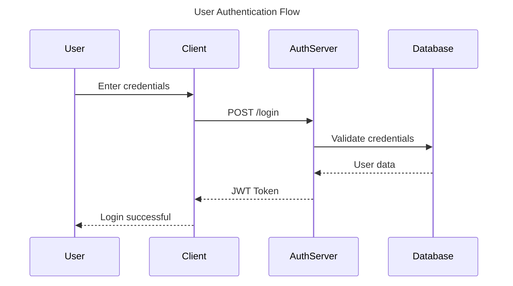
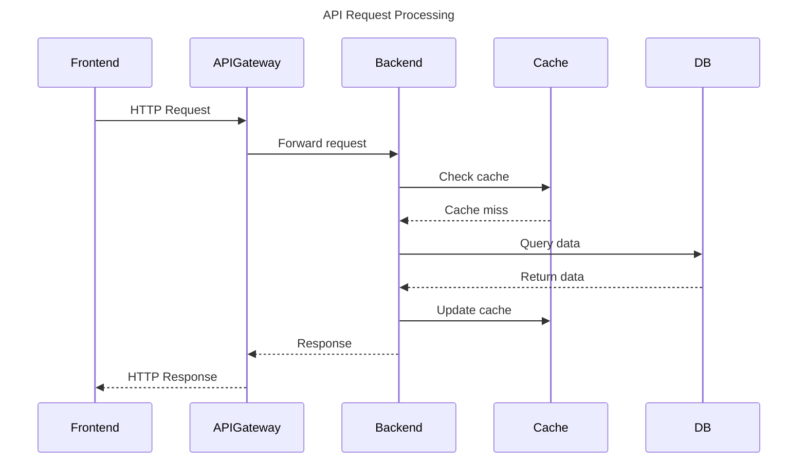
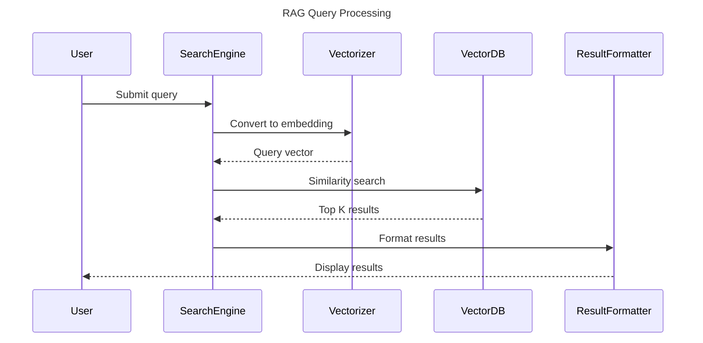

# Sequence Chart Examples

This document contains example sequence diagrams for testing the chart processing module.

## User Authentication Flow

The following sequence diagram shows a typical user authentication flow:

## API Request Flow

Here's an example of a typical API request flow:

## RAG System Flow

This diagram shows how the RAG system processes queries:

## Description

These sequence diagrams illustrate common patterns in software systems:

1. **Authentication**: Shows the typical login flow with credential validation
2. **API Request**: Demonstrates caching strategy for API responses
3. **RAG Pipeline**: Illustrates the query processing in a RAG system

Each diagram can be exported as an image, and its description will be vectorized for semantic search.
